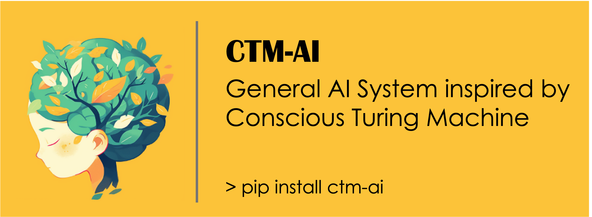

<h1 align="center">CTM-AI: A Blueprint for Implementing a General AI System Inspired by Consciousness</h1>

<div align="center">
  
[](https://pypi.org/project/ctm-ai/)
[](https://www.python.org/downloads/release/python-3109/)
[](https://github.com/hiyouga/LLaMA-Factory/pulls)

</div>

## News

* [Jan 19] We release our python package `pip install ctm-ai` to use in one click.

## Introduction

**CTM-AI** is a component-based multimodal training and inference framework that support any modality input and text-form output. Its key architecture is motivated by Conscious Turing Machine (CTM) [[paper]](https://arxiv.org/abs/2107.13704). Each CTM includes multiple processors to handle inputs from different modalities and it includes up-tree and down-tree process to conduct iterative inference process.

## Get started

### Install from pip

You can install `ctm-ai` from `pypi` to use it as a package:

```bash
pip install ctm-ai
```

### Install from scratch

Use a virtual environment, e.g. with anaconda3:

```bash
conda create -n ctm-space python=3.10
conda activate ctm-space
curl -sSL https://install.python-poetry.org | python3
export PATH="$HOME/.local/bin:$PATH"
```

### Running the examples
To run examples provided in the `examples`:

```bash
poetry install
cd examples
python sarcasm_detection.py
```

## Developing

#### Develop Demo

To develop the CTM-AI inference demo (both frontend and backend), please follow the instructions below.

For frontend development:

```bash
cd frontend
npm install
npm start
```

For backend development:

```bash
poetry install -E backend
uvicorn backend.app.main:app --reload
```

#### Install dev options

Follow the installation instruction above and then, instead of running `python -m pip install -e .`, run the following commands:

```
python -m pip install -e ".[dev]"
mypy --install-types --non-interactive research_town
python -m pip install pre-commit
pre-commit clean
pre-commit install
```

The installation of pre-commit would avoid formatting error and large file injects into github commits.
